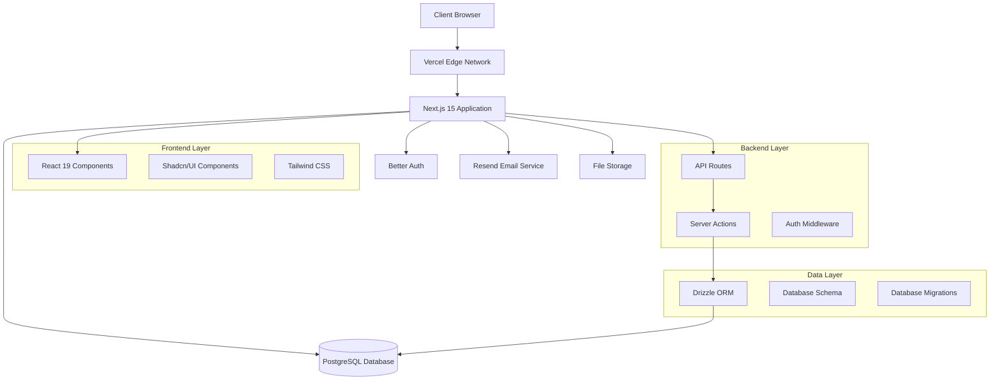
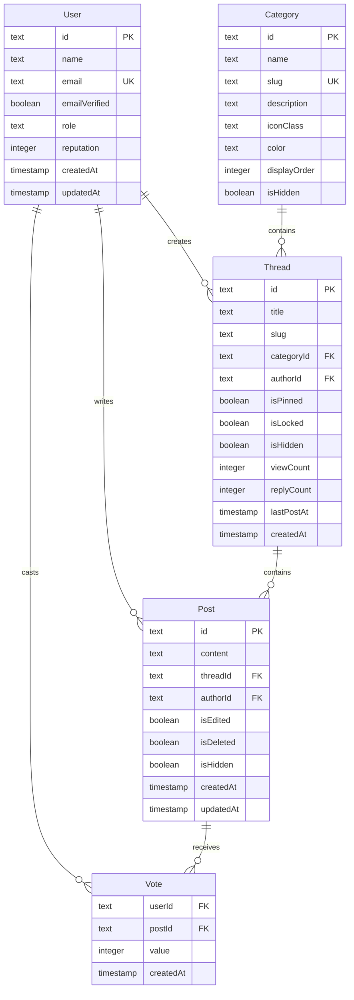

# System Architecture

OpenForum is built with modern web technologies, following best practices for scalability, performance, and maintainability. This guide provides a comprehensive overview of the system architecture.

## 🏗️ High-Level Architecture



## 🔧 Technology Stack

### Frontend Technologies

**React 19 with Next.js 15**
- **Server Components**: Improved performance with RSC
- **App Router**: File-based routing with layouts
- **Server Actions**: Direct server-side mutations
- **Streaming**: Progressive content loading
- **Static Generation**: Pre-rendered pages for performance

**UI Framework**
- **Tailwind CSS**: Utility-first styling framework
- **Shadcn/UI**: Accessible, customizable components
- **Radix UI**: Headless component primitives
- **Lucide Icons**: Consistent iconography

**State Management**
- **React State**: Built-in state management
- **Server State**: Server Actions and React Query patterns
- **URL State**: Search params for filtering/pagination
- **Form State**: React Hook Form with Zod validation

### Backend Technologies

**Next.js API Layer**
- **API Routes**: RESTful endpoints
- **Server Actions**: Type-safe server mutations
- **Middleware**: Authentication and request processing
- **Edge Runtime**: Fast, globally distributed compute

**Authentication System**
- **Better Auth**: Modern authentication library
- **Session Management**: Secure session handling
- **OAuth Integration**: Google, GitHub providers
- **Email Verification**: OTP-based verification
- **Two-Factor Auth**: TOTP support

**Database Layer**
- **PostgreSQL**: Relational database with ACID compliance
- **Drizzle ORM**: Type-safe database queries
- **Connection Pooling**: Efficient database connections
- **Migrations**: Version-controlled schema changes

## 📊 Database Architecture

### Schema Design



### Key Relationships

**User-Centric Relationships**
- Users create threads and posts
- Users vote on posts (upvote/downvote)
- Users subscribe to threads and categories
- Users receive notifications for activity

**Content Hierarchy**
- Categories contain threads
- Threads contain posts (including original post)
- Posts can be voted on and reported
- Tags provide cross-cutting categorization

**Moderation Structure**
- Content can be hidden, locked, or deleted
- Reports link users to content requiring review
- Moderation actions are logged for auditing

### Database Indexes

**Performance Indexes**
```sql
-- User lookups
CREATE INDEX user_email_idx ON "user"(email);
CREATE INDEX user_role_idx ON "user"(role);

-- Thread queries
CREATE INDEX thread_category_id_idx ON thread(categoryId);
CREATE INDEX thread_author_id_idx ON thread(authorId);
CREATE INDEX thread_last_post_at_idx ON thread(lastPostAt);
CREATE INDEX thread_slug_idx ON thread(slug);

-- Post queries
CREATE INDEX post_thread_id_idx ON post(threadId);
CREATE INDEX post_author_id_idx ON post(authorId);
CREATE INDEX post_created_at_idx ON post(createdAt);

-- Vote queries
CREATE INDEX vote_user_id_idx ON vote(userId);
CREATE INDEX vote_post_id_idx ON vote(postId);
```

## 🔐 Authentication Architecture

### Better Auth Integration

```typescript
// lib/auth.ts
export const auth = betterAuth({
  database: drizzleAdapter(db, {
    provider: "pg",
  }),
  emailAndPassword: {
    enabled: true,
  },
  plugins: [
    twoFactor(),
    admin(),
    username(),
    organization(),
    emailOTP({
      async sendVerificationOTP({ email, otp, type }) {
        await sendVerificationEmail({ email, otp, type });
      },
      otpLength: 6,
      expiresIn: 900, // 15 minutes
    }),
    nextCookies()
  ],
  socialProviders: {
    google: {
      clientId: process.env.GOOGLE_CLIENT_ID,
      clientSecret: process.env.GOOGLE_CLIENT_SECRET,
    },
    github: {
      clientId: process.env.GITHUB_CLIENT_ID,
      clientSecret: process.env.GITHUB_CLIENT_SECRET,
    },
  },
});
```

### Authentication Flow

**Registration Process**
1. User submits registration form
2. Server validates input and creates user
3. Email verification OTP sent
4. User enters OTP to verify email
5. Account activated and session created

**Login Process**
1. User submits credentials
2. Server validates against database
3. Session created and stored
4. Client receives session cookie
5. Subsequent requests authenticated

**OAuth Flow**
1. User clicks OAuth provider button
2. Redirect to provider authorization
3. Provider callback with authorization code
4. Exchange code for user information
5. Create or link user account
6. Establish session

### Session Management

**Session Storage**
- Database-stored sessions
- Secure HTTP-only cookies
- CSRF protection
- Session rotation
- Automatic cleanup of expired sessions

**Security Features**
- IP address validation
- User agent fingerprinting
- Session timeout
- Concurrent session limits
- Two-factor authentication support

## 🎨 Component Architecture

### Component Hierarchy

```
App Layout
├── Header Component
│   ├── Navigation Menu
│   ├── User Dropdown
│   └── Search Bar
├── Main Content Area
│   ├── View Components (Page-level)
│   │   ├── Forum Home View
│   │   ├── Category View
│   │   ├── Thread View
│   │   └── Admin Views
│   └── Feature Components
│       ├── Thread Card
│       ├── Post Component
│       ├── Category Icon
│       └── Vote Buttons
├── Sidebar (Context-specific)
│   ├── Category List
│   ├── User Stats
│   └── Quick Actions
└── Footer Component
```

### Component Types

**Page Components** (`app/` directory)
- Route-based page components
- Server-side data fetching
- Layout composition
- SEO metadata

**View Components** (`components/views/`)
- Large, page-level components
- Complex state management
- Multiple feature integration
- Responsive design

**Feature Components** (`components/forum/`)
- Specific functionality components
- Business logic encapsulation
- Reusable across views
- Props-based configuration

**UI Components** (`components/ui/`)
- Basic design system components
- No business logic
- Highly reusable
- Consistent styling

### State Management Patterns

**Server State**
```typescript
// Server Actions for data mutations
async function createThread(data: ThreadFormData) {
  const session = await auth.api.getSession({ headers: await headers() });
  if (!session) throw new Error("Unauthorized");
  
  return await db.insert(thread).values({
    ...data,
    authorId: session.user.id,
  });
}
```

**Client State**
```typescript
// Local component state
const [isEditing, setIsEditing] = useState(false);
const [content, setContent] = useState(post.content);

// URL state for filters
const searchParams = useSearchParams();
const category = searchParams.get('category');
```

## 🚀 Performance Architecture

### Rendering Strategy

**Server-Side Rendering (SSR)**
- Dynamic pages with user-specific content
- Authentication-dependent pages
- Real-time data requirements

**Static Site Generation (SSG)**
- Public pages without user context
- Landing pages and documentation
- Category and thread listings (with ISR)

**Client-Side Rendering (CSR)**
- Interactive components
- Form submissions
- Real-time features

### Caching Strategy

**Database Caching**
```typescript
// Query result caching
const categories = await db.query.category.findMany({
  // Cached at database level
  orderBy: [asc(category.displayOrder)],
});
```

**Component Caching**
```typescript
// React Server Component caching
export default async function CategoriesPage() {
  const categories = await getCategories(); // Cached
  return <CategoriesView categories={categories} />;
}
```

**Edge Caching**
- Static assets cached at CDN edge
- API responses cached with appropriate headers
- Dynamic content with short-term caching

### Optimization Techniques

**Bundle Optimization**
- Tree shaking for smaller bundles
- Code splitting for lazy loading
- Dynamic imports for large components

**Image Optimization**
- Next.js Image component
- WebP format conversion
- Responsive image sizing
- Lazy loading

**Database Optimization**
- Query optimization with indexes
- Connection pooling
- Prepared statements
- Query result caching

## 🔧 Development Architecture

### File Organization

```
src/
├── app/                    # Next.js App Router
│   ├── (auth)/            # Route groups
│   ├── forum/             # Forum pages
│   └── api/               # API routes
├── components/            # React components
│   ├── ui/                # Design system
│   ├── forum/             # Feature components
│   └── views/             # Page components
├── lib/                   # Utilities
│   ├── auth.ts            # Authentication config
│   ├── db.ts              # Database config
│   └── utils.ts           # Helper functions
├── actions/               # Server Actions
├── db/                    # Database schema
└── types/                 # TypeScript definitions
```

### Code Quality

**TypeScript Configuration**
```json
{
  "compilerOptions": {
    "strict": true,
    "noImplicitAny": true,
    "strictNullChecks": true,
    "noImplicitReturns": true
  }
}
```

**ESLint Configuration**
- Next.js recommended rules
- React best practices
- Accessibility checks
- Import organization

**Testing Strategy**
- Unit tests for utilities
- Component testing with React Testing Library
- Integration tests for critical flows
- E2E tests with Playwright

### Development Workflow

**Local Development**
```bash
# Start development server
pnpm dev

# Run type checking
pnpm type-check

# Run linting
pnpm lint

# Database operations
pnpm drizzle-kit studio
pnpm drizzle-kit migrate
```

**Git Workflow**
1. Feature branch from main
2. Development and testing
3. Pull request review
4. Automated CI/CD pipeline
5. Merge to main and deploy

## 📈 Scalability Considerations

### Horizontal Scaling

**Application Scaling**
- Stateless application design
- Load balancer distribution
- Multiple application instances
- Session storage externalization

**Database Scaling**
- Read replicas for query distribution
- Connection pooling
- Query optimization
- Partitioning for large tables

### Performance Monitoring

**Application Metrics**
- Response time monitoring
- Error rate tracking
- User engagement metrics
- Performance bottleneck identification

**Infrastructure Metrics**
- Server resource utilization
- Database performance
- CDN cache hit rates
- Network latency measurements

### Future Enhancements

**Real-time Features**
- WebSocket integration for live updates
- Real-time notifications
- Live chat functionality
- Collaborative editing

**Advanced Features**
- Full-text search with Elasticsearch
- Content recommendation engine
- Advanced analytics dashboard
- API rate limiting and throttling

This architecture provides a solid foundation for a scalable, maintainable forum application while remaining flexible for future enhancements and customizations.
